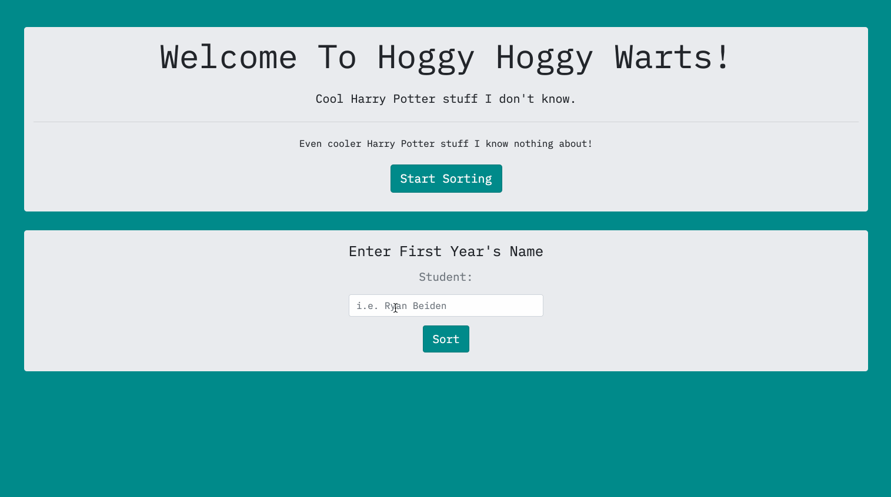
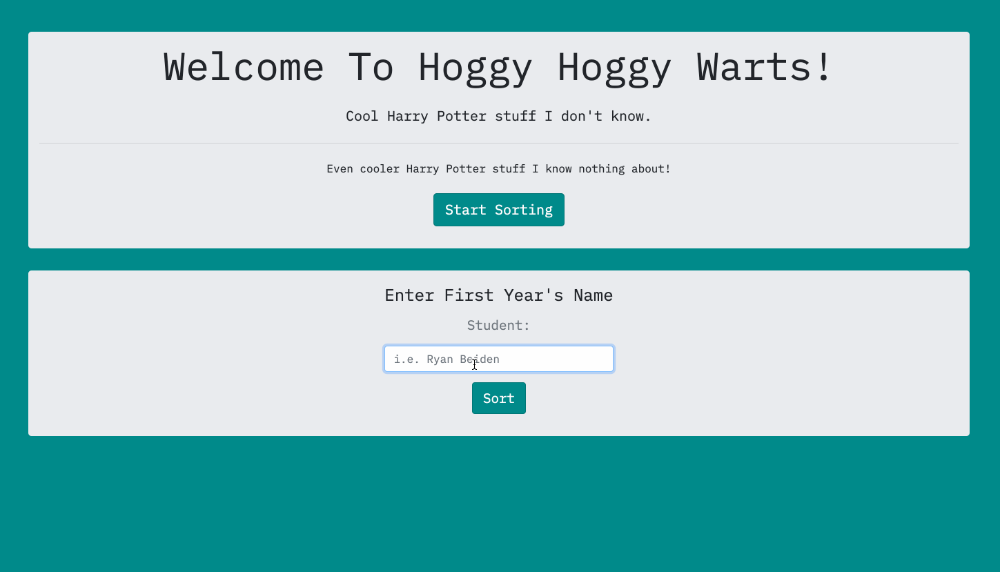

# Sorting Hat

This web app allows you to start Sorting Students to their Houses randomly. By selecting **Start Sorting**, you will be given a form where you can insert a name and select the **Sort** button. The name will appear as it's own card beneath the form giving that name a random House. Behind the scenes, the name is also given a unique ID, so when the **Expel** button is selected, the Student is removed from the House.

## Preview

Web App in use:

---

If nothing is entered into the form:

## Deployed Project
https://rb-sorting-hat.web.app/

## View Project
- Clone it 👉🏼`$ git clone https://github.com/RyanBeiden/sorting-hat.git`

- Run any http server with`$ hs` or view within a code editor

## Technologies Used
  

#### Backlog/Roadmap

Build a section where the "Expelled" students go after you click the button on their card instead of just removing them completely.
